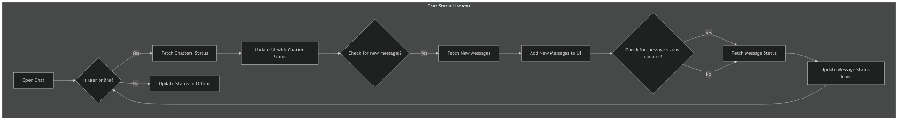
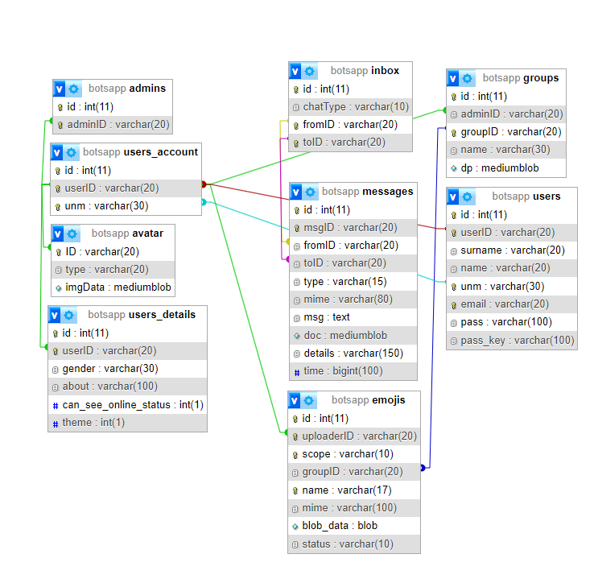
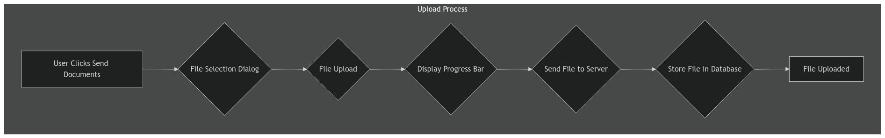
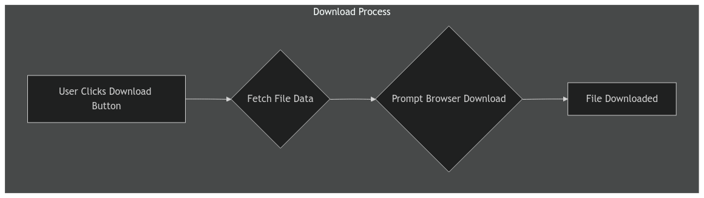

<p style="text-align:center;">
    A <br>
Project Report <br>
 on
</p>

<h2 style="text-align: center;">"BotsApp - A Better Place for Chat"</h2>

<br>
<br>
<br>

```md
|-----------------------------------------------------------------------------|
|                           Submitted By:                                     |
|                           BCA Semester–5                                    |
|-----------------------------------------------------------------------------|
```

<br>
<br>
<br>
<br>

```md
|-----------------------------------------------------------------------------|
|                         Submitted To:                                       |
|                                                                             |
|          Geetanjali College of Computer Science and Commerce(BCA)           |
|              Indian Redcross Building, Opp. Shastri Maidan,                 |
|                      Suchak Road, Rajkot-360002                             |
|                                                                             |
|                       Saurashtra University                                 |
|                               Rajkot,                                       |       
|                                                                             |
|                       Academic Year: 2024-2025                              |     
|-----------------------------------------------------------------------------|
```


```md
|-----------------------------------------------------------------------------|
|                           Project Guide:                                    |
|                         Prof. Pranav Trivedi                                |
|-----------------------------------------------------------------------------|
```

<div class="page" />

<h3>Project Profile: BotsApp</h3>

**Project Overview:**

BotsApp is a web application developed using HTML, CSS, PHP, and MySQL. The project was created for Bachelor of Computer Applications(B.C.A) Degree semester 5 project. 

**Technical Details:**

* **Development Environment:**
    * IDE: VS Code
    * Server: XAMPP
    * Browser: Brave, Edge
* **Technologies:**
    * Frontend: HTML, CSS, JS
    * Backend: PHP, MySQL
* **Operating System:** Windows
* **Documentation:** Created using VS Code & Markdown

**Project Team:**

* Developer: Darshit Limbad

**Submission:**

* Submitted to: Geetanjali College

**Timeline:**

* Academic Year: 2024-2025

**Key Features:**

* Real-time chat functionality 
* User profile management
* Group Creation and manage
* Emojis Uploading

**Project Goals:**

* To create a user-friendly platform for communication
* To implement a chat system for People.
* To learn how chat application works.

**Project Significance:**

* BotsApp offers a convenient way to communicate with user to user or group.
* This project explores the potential of chat technology in Web.


***


<h3 style="text-align: center;">"A Better Place for Chat"</h3>

```md
    BotsApp - Web Chat Application
    Copyright (C) 2024  Darshit Limbad

    This program is free software: you can redistribute it and/or modify
    it under the terms of the GNU General Public License as published by
    the Free Software Foundation, either version 3 of the License, any later version.

    This program is distributed in the hope that it will be useful,
    but WITHOUT ANY WARRANTY; without even the implied warranty of
    MERCHANTABILITY or FITNESS FOR A PARTICULAR PURPOSE.  See the
    GNU General Public License for more details.

    You should have received a copy of the GNU General Public License
    along with this program.  If not, see <https://www.gnu.org/licenses/>.
```
<div class="page" />

## **BotsApp Documentation - Indexing**

**I. Introduction**

* **1.1 Welcome and Overview**
* **1.2 Target Audience**
* **1.3 Next Steps**

**II. System Architecture**

* **2.1 Frontend and Backend Overview**
* **2.2 Technology Stack**
* **2.3 Key Interactions**

**III. Technology Stack**

* **3.1 Frontend Technologies**
    * **3.1.1 HTML**
    * **3.1.2 CSS**
    * **3.1.3 JavaScript**
* **3.2 Backend Technologies**
    * **3.2.1 PHP**
    * **3.2.2 MySQL**
* **3.3 Security Technologies**
    * **3.3.1 Bcrypt**
    * **3.3.2 Sodium**

**IV. Frontend Implementation (JavaScript)**

* **4.1 Data Fetching and Sending**
    * **4.1.1 Native HTML Forms**
    * **4.1.2 `postReq` Function**
    * **4.1.3 Handling Group and Personal Chat Data**
* **4.2 Status Management**
    * **4.2.1 `userStatus` Object**
    * **4.2.2 `setOnlineStatusUpdateInterval()` Function**
    * **4.2.3 `onlineStatusUpdate()` Function**
    * **4.2.4 `checkStatus()` Function**
    * **4.2.5 Message Status Management** 
* **4.3 Additional Functionality**
    * **4.3.1 User Profile Management**
    * **4.3.2 Group Chat Management**
    * **4.3.3 Member Actions**
    * **4.3.4 Custom Emoji System**
    * **4.3.5 Chat Request System**

**V. Backend Implementation (PHP)**

* **5.1 Database Structure**
    * **5.1.1 Main Database (`botsapp`)**
        * **5.1.1.1 Table: `users`**
        * **5.1.1.2 Table: `users_account`**
        * **5.1.1.3 Table: `users_details`**
        * **5.1.1.4 Table: `groups`**
        * **5.1.1.5 Table: `inbox`**
        * **5.1.1.6 Table: `messages`**
        * **5.1.1.7 Table: `admins`**
        * **5.1.1.8 Table: `avatar`**
        * **5.1.1.9 Table: `emojis`**
    * **5.1.2 Status Database (`botsapp_statusdb`)**
        * **5.1.2.1 Table: `messages`**
        * **5.1.2.2 Table: `blocked`**
        * **5.1.2.3 Table: `notification`**
        * **5.1.2.4 Table: `on_status`**
        * **5.1.2.5 Table: `reports`**

**VI. Security**

* **6.1 Overview**
* **6.2 Password Hashing with Bcrypt**
* **6.3 Sodium Encryption for Browser Login Details**
* **6.4 SQL Injection Protection with Prepared Statements**
* **6.5 Session Handling and Authentication**

**VII. Core Functionality**

* **7.1 User Login Flow**
    * **7.1.1 IndexedDB for Login Credentials**
    * **7.1.2 Decryption and Verification**

**VIII. Chat Features**

* **8.1 Group Chat Management**
* **8.2 File and Image Sharing**
* **8.3 Custom Emoji System**
* **8.4 Chat Request System**

**IX. Challenges and Solutions**

* **9.1 Avoiding WebSockets: Polling as an Alternative**
* **9.2 Implementing a Fully Native Web Approach**
* **9.3 Security Considerations**

**X. Testing**

* **10.1 Manual Testing**
    * **10.1.1 Functionality Testing**
    * **10.1.2 Usability Testing**
    * **10.1.3 Performance Testing**
* **10.2 Security and Authentication Testing**
    * **10.2.1 Vulnerability Scanning**
    * **10.2.2 Penetration Testing**
    * **10.2.3 Authentication Testing**

**XI. Error Handling**

* **11.1 Error Handling in JavaScript**
    * **11.1.1 `customError` Function**
    * **11.1.2 `handler` Object**
    * **11.1.3 `new_Alert` and `new_notification` Functions**
    * **11.1.4 `DOMContentLoaded` Event Listener**
* **11.2 Error Handling in PHP**
* **11.3 Error Reporting**

**XII. Appendix**

* **12.1 Glossary**
* **12.2 Error Codes and Messages**
* **12.3 References** 

***
<div class="page" />

## **I. Introduction:**

Welcome to the BotsApp Documentation! This guide provides a comprehensive overview of the BotsApp web application, designed to facilitate seamless communication and collaboration.  

BotsApp is a fully native web application built with a focus on user-friendliness, reliability, and security.  It offers a robust set of features for both personal and group chats, including:

* **Real-time messaging:**  Enjoy instant communication with friends, family, and colleagues.
* **Group chats:**  Stay connected with multiple people in a single chat.
* **File and image sharing:**  Easily share documents and images within conversations.
* **Custom emojis:**  Express yourself with a library of emojis, including the ability to upload your own.
* **Chat requests:**  Connect with new users seamlessly using usernames.
* **Group management:**  Create and manage group chats with administrative controls. 
* **Secure communication:**  Enjoy peace of mind with robust security measures for user data and authentication.

### **Target Audience:**

This documentation is primarily intended for developers who need to understand the technical aspects of BotsApp, including its frontend (JavaScript) and backend (PHP) implementation. It will also be useful for designers and testers involved in the development process.

### **Next Steps:**

Continue reading to learn more about the system architecture, database structure, frontend and backend code, security measures, and testing procedures. 


<div class="page"/>


## **II. System Architecture**

### **2.1 Frontend and Backend Overview**

BotsApp is a client-server application, meaning it consists of two main components:

* **Frontend:** The user interface (UI) that users interact with. This is built using HTML, CSS, and JavaScript. 
* **Backend:**  The server-side logic that handles data processing, database interactions, and communication with the frontend. This is implemented using PHP and MySQL.

```md
+--------+          +---------+          +-----------+ 
| Client | <----->  | Server  | <----->  | Database  |
+--------+          +---------+          +-----------+
       | Chat Request  |           | User Data |
       | User Login    |           | Chat Messages |
       | File Upload   |           | Group Information |
       | Emoji Fetch   |           | Emoji Data |
       <----- Chat Response |       <----  Response |
       <----- User Data |           <----  Chat Messages |
       <----- File Data |           <----  Group Data |
       <----- Emoji Data |           <----  Emoji Data |
```

The frontend (JavaScript) sends requests to the backend (PHP) using AJAX (Asynchronous JavaScript and XML) requests. These requests are typically in JSON format and are handled by specific PHP scripts on the server. The backend interacts with the MySQL database to store and retrieve user data, chat messages, group information, and other relevant data.

### **2.2 Technology Stack**

BotsApp utilizes a combination of technologies to deliver a robust and feature-rich chat experience:

* **HTML:** Provides the structural foundation of the user interface, defining elements like chat windows, forms, and buttons.
* **CSS:**  Styles the user interface, creating the visual appearance and layout of the application.
* **JavaScript:**  Handles dynamic behavior, user interactions, and communication with the backend.
* **PHP:**  Manages server-side logic, database interactions, and data processing.
* **MySQL:**  Provides the database system for storing and retrieving application data.
* **Bcrypt:**  Used for secure password hashing.
* **Sodium:**  Used for encrypting sensitive user information in the browser.

**Key Interactions:**

* **Frontend to Backend:** The frontend sends AJAX requests to PHP scripts on the server to perform actions like sending messages, fetching chat data, and updating user profiles.
* **Backend to Database:**  The PHP scripts interact with the MySQL database to store and retrieve data, ensuring data persistence and security.

**Next Steps:**

In the following sections, we'll explore the details of the frontend and backend implementations, including the database structure, security measures, and key functionalities. 


## **III. Technology Stack**

BotsApp utilizes a combination of technologies to deliver a robust and feature-rich chat experience.  Each technology plays a crucial role in building the frontend user interface, the backend server logic, and the underlying database.

### **3.1 Frontend Technologies**

* **HTML (HyperText Markup Language):**  HTML provides the structural foundation of the BotsApp user interface.  It defines the layout, elements, and content of the application, such as chat windows, forms, buttons, and text areas.  

* **CSS (Cascading Style Sheets):**  CSS is responsible for styling the BotsApp user interface, creating its visual appearance and layout.  It controls aspects like colors, fonts, spacing, and the responsive behavior of the application across different screen sizes.

* **JavaScript:**  JavaScript is the core of the BotsApp frontend, handling dynamic behavior, user interactions, and communication with the backend server. It powers features like real-time messaging, user input, UI updates, and asynchronous file operations.

**3.2 Backend Technologies**

* **PHP (Hypertext Preprocessor):** PHP is the server-side language that manages BotsApp's backend logic. It handles data processing, database interactions, authentication, and communication with the frontend using AJAX requests.

* **MySQL:**  MySQL is the relational database management system (RDBMS) used to store and manage BotsApp's data, including user information, chat messages, group details, and emojis. 

**3.3 Security Technologies**

* **Bcrypt:**  Bcrypt is a robust password hashing algorithm used to secure user passwords. It converts plain-text passwords into irreversible hashes, making it difficult for attackers to steal or compromise user credentials.

* **Sodium:**  Sodium is a library used for cryptographic operations, including encryption and decryption. In BotsApp, it is used to encrypt sensitive user information stored in the browser, such as session tokens, to enhance security.

**Next Steps:**

In the following sections, we'll delve deeper into the specific implementations of these technologies, including the database structure, security measures, and key functionalities of the chat application.

<div class="page" />

```md
+--------+          +---------+          +-----------+ 
| Client | <----->  | Server  | <----->  | Database  |
+--------+          +---------+          +-----------+

     |             |            |
     |             |            |
  +---+ +---+   +---+ +---+   +---+ +---+
  | HTML | | CSS | | JS | | PHP | | MySQL | 
  +---+ +---+   +---+ +---+   +---+ +---+
```

<div class="page" />

## **IV. Frontend Implementation (JavaScript)**

### **4.1 Data Fetching and Sending**

BotsApp relies on a robust data communication system to manage chat conversations, notifications, and user data. This section explores the frontend's data fetching and sending mechanisms, highlighting the use of native HTML forms, the custom `postReq` function, and how data is handled for both personal and group chats.

#### **4.1.1 Native HTML Forms**

BotsApp utilizes native HTML forms for user interactions like login, registration. These forms provide a user-friendly interface for collecting input data. 

**Example:**

* **Login Form:**  The login form typically includes input fields for the username or email and password.
* **Registration Form:**  The registration form include fields for username, email, password, and potentially other user details.


#### **4.1.2  `postReq(url, data, options)` Function**

The `postReq` function is a core component of BotsApp's data communication system. It wraps the standard `XMLHttpRequest` object, providing a standardized and versatile way to make asynchronous HTTP requests to the server.

**Key Features of `postReq`:**

* **Method Flexibility:**  Allows you to use both POST and GET requests.
* **Asynchronous Operations:**  Handles requests asynchronously, allowing the UI to remain responsive.
* **Progress Tracking:**  Provides progress updates for file uploads and downloads.
* **Request Cancellation:**  Offers the ability to abort requests if needed.

```md
-> A diagram showing the structure of a typical XHR request. :

+---------------------+
|     HTTP Request    |
+---------------------+
| Method: GET/POST    |
| Endpoint: /api/data |
| Headers:            |
|  Content-Type       |
|  Accept             |
|  Authorization      |
| Body: { ... }      |  <-- Optional
+---------------------+

                  ↓

+---------------------+
|        Server       |
+---------------------+
| Process Request     |
| Generate Response   |
+---------------------+

                  ↓
                  
+---------------------+
|    XHR Object     |
+---------------------+
| Handle Response    |
+---------------------+
```

**Example Usage:**

```javascript
// Send a POST request to the chat endpoint to send a message
postReq('/functionality/lib/_chat.php', JSON.stringify({ req: 'sendMsg', msg: 'Hello!' }))
    .then(response => {
        if (response.status === 'success') {
            console.log('Message sent successfully:', response.responseText);
        } else {
            console.error('Error sending message:', response.error);
        }
    })
    .catch(error => {
        console.error('Error:', error);
    });
```

#### **4.1.3 Handling Group and Personal Chat Data**

BotsApp differentiates between group and personal chat data to manage conversations and display messages appropriately. Here's how it works:

1. **Chat Type:** The `chatType` cookie is set when a user selects either "Personal" or "Group" from the sidebar.
2. **Data Retrieval:** When fetching chat data (using `getChatList`, `getAllMsgs`, or `getNewMsgs`), the `chatType` is used to construct the appropriate SQL query for retrieving the correct messages.
3. **UI Display:** The frontend code uses the `chatType` to display messages and UI elements differently for personal and group chats. For example:
    * **Personal Chats:**  The chat window displays the username of the other user.
    * **Group Chats:** The chat window displays the group name and the usernames of all members.
4. Users can also see other users or groups details  by clicking on the user/group name while chat is opened.
5. Users cam perform aplicable actions also available action is displayed below:
    * **Actions for User:** Delete User, Blocking user, Reporting User.
    * **Actions for group:** Leave Group, Add new Members, Group Emojis, Add Emojis.
    * **Advanced Action for group admin** Delete Group.
6. Group members can also change group details like Group profile picture, Group Name,
7. **last but not least**: If you are wondering about namming confilicts then don't because usernames are already unique and for group named i am sending encrypted group id's to client side for any group operations and chating.

### **4.2  Status Management**

BotsApp's status management system is designed to provide real-time updates on user activity and message statuses, enhancing the user experience and facilitating smooth communication. This section explores the JavaScript code responsible for managing online status and message read/send statuses.

#### **4.2.1 `userStatus` Object:**

The `userStatus` object is a central component of the frontend status management system. It holds crucial information and functions related to user and message statuses:

* **`statusURL`:**  The URL of the server-side PHP script (`_status.php`) that handles status updates and data retrieval.
* **`msgStatusPath`:** The path to the directory containing the status icons used in the UI (e.g., `"/img/icons/chat/msg_status/"`).
* **`isOnline`:**  A boolean flag that indicates whether the current user is online (true) or offline (false).
* **`adminOnlineStatusIcon`:**  A reference to the DOM element that displays the online status of the admin (if applicable).

`NOTE`: Here admin is just a word for the current user.

#### **4.2.2 `setOnlineStatusUpdateInterval()`:**

This function is responsible for setting up the interval that periodically checks and updates the user's online status. It works as follows:

1. **Initial Check:**  It calls the `onlineStatusUpdate()` function to get the user's initial online status.
2. **Interval Setup:**  It uses `setInterval` to repeatedly call `onlineStatusUpdate()` at a specified interval (`#requestTime`). This ensures that the user's online status is updated regularly.
3. **Offline/Online Handlers:**  It attaches event listeners (`window.onoffline` and `window.ononline`) to handle cases where the user's internet connection is lost or restored. These handlers ensure that the `onlineStatusUpdate` interval is resumed when the connection is back online. 

#### **4.2.3 `onlineStatusUpdate()`:**

This function updates the user's online status in the database and reflects the change in the UI. Here's how it works:

1. **Send Status Update:**  It sends a POST request to the server using `postReq` to update the user's online status in the `on_status` table.
2. **Update `isOnline` Flag:**  It updates the `isOnline` flag based on the server's response. If the update is successful, `isOnline` is set to `true`; otherwise, it's set to `false`.
3. **Update UI:**  It updates the online status icon (`adminOnlineStatusIcon`) in the UI using `classList.replace`. If the user is online, the icon's color is changed to green; otherwise, it's changed to red.

#### **4.2.4 `checkStatus()`:**

This function is responsible for fetching the status of other chatters in the current conversation and updating the UI accordingly. This is where real-time updates happen.

1. **Fetch Status Data:** It sends a POST request to the server using `postReq` to retrieve the status information for other chatters.
2. **Process Response:**  It processes the response data from the server:
    * **Personal Chats:**  It updates the `--userStatusColor` style property for each `inboxUser` element in the chat list to reflect the chatter's status (online, last active, new user, offline). It also updates the `currentChatterStatus` element to show the online status of the current chatter.
    * **Group Chats:**  It updates the UI to show the number of new messages for the group.
    * **Message Status:**  It checks for read status updates of sent messages and changes the `msgStatusIcon` if needed.
3. **Update UI:**  It updates the UI elements (chat list, chat window) based on the fetched status data, including displaying new messages and updating status icons.

#### **4.2.5 Message Status Management**

* **`_getMsgStatus(msgIDs)`:** This function fetches the status of a set of messages (read/send/uploaded) from the server. It uses `postReq` to send a request to the server.

* **`_placeMsgStatus(msgStatusImage, msgID)`:** This function updates the `msgStatusImage` (a DOM element) to reflect the status of a message. It fetches the message status from the server and updates the image accordingly.

* **`_getMsgSeenData(msgID)`:** This function fetches information about who has seen a specific message in a group chat. It uses `postReq` to send a request to the server.

**A flowchart illustrating the status management process:**





**Next Steps:**

In the next section, we'll delve into the notification system used in BotsApp, explaining how it works on both the frontend and backend. 

### **4.3 Additional Functionality**

This section explores the JavaScript functions that power BotsApp's core features beyond the basic chat functionality, including:

* User Profile Management
* Group Chat Management
* Member Actions 
* Custom Emoji System
* Chat Request System

#### **4.3.1 User Profile Management**

BotsApp allows users to view and edit their profile information. Here are the relevant functions:

* **`getProfile()`:** 
    * This function retrieves the user's profile data from the server (likely using `postReq` to `_fetch_data.php`).
    * It returns a Promise that resolves with the user's profile information, including their name, gender, about (bio), email, and whether they can see other users' online status. 
* **`editGroupDetails(column, value)`:** 
    * This function is primarily used for updating group details (name or profile picture).
    * It sends a POST request to the server using `postReq` to update the specified `column` (e.g., `name`, `dp`) with the provided `value`.
    * It returns a Promise that resolves with 1 if the update is successful, otherwise throws an error or returns 0.

    * **`_blockChat()`:** This function blocks a chat conversation, preventing the user from receiving messages from the other party.

    * **`_reportChat(reportReason)`:** This function reports a user or group chat. 

    * **`getBlockedMemberList()`:** This function fetches a list of users blocked by the current user.

    * **`_unblockMember(unm)`:** This function unblocks a previously blocked user.


**Example Usage:**

```javascript
// Fetch the user's profile data
getProfile()
    .then(profile => {
        // Update the UI with the profile information
        document.querySelector('.profile-dp img').src = profile.profile_pic;
        document.querySelector('.profile-dp .text').textContent = profile.unm;
        document.querySelector('.profile-dp .name').textContent = profile.name;
        document.querySelector('.profile-dp .about').textContent = profile.about;
        document.querySelector('.profile-dp .gender').textContent = profile.gender;
        document.querySelector('.profile-dp .email').textContent = profile.email;
        document.querySelector('.profile-dp .can_see_on_status').textContent = profile.can_see_on_status ? 'Yes' : 'No';
    })
    .catch(error => {
        console.error('Error fetching profile:', error);
    });
```

#### **4.3.2 Group Chat Management**

BotsApp provides functionality for creating, managing, and deleting group chats. Here are the key functions:

* **`createNewGroup(name, memberList)`:**
    * This function creates a new group chat on the server.
    * It sends a POST request to the server using `postReq` to the `_insert_data.php` script.
    * The request includes the `name` of the group and a JSON-encoded array of `memberList` (usernames) to be added to the group.
    * It returns a Promise that resolves with 1 if the group creation is successful, otherwise throws an error or returns 0.
* **`_addNewMember(unmList)`:**
    * This function adds new members to an existing group chat.
    * It sends a POST request to the server using `postReq` to the `_insert_data.php` script.
    * The request includes a JSON-encoded array of `unmList` (usernames) to be added.
    * It returns a Promise that resolves with 1 if the member addition is successful, otherwise throws an error or returns 0.
* **`_removeMember(unm)`:**
    * This function removes a member from a group chat.
    * It sends a POST request to the server using `postReq` to the `_data_delete.php` script.
    * The request includes the `unm` (username) of the member to be removed. 
    * It returns a Promise that resolves with 1 if the member removal is successful, otherwise throws an error or returns 0.
* **`deleteChat()`:**
    * This function deletes an entire group chat.
    * It sends a POST request to the server using `postReq` to the `data_delete.php` script.
    * It returns a Promise that resolves with 1 if the deletion is successful, otherwise throws an error or returns 0.
* **`editGroupDetails(column, value)`:**
    * This function updates the details of a group chat (e.g., group name, profile picture).
    * It sends a POST request to the server using `postReq` to the `_chat.php` script.
    * The request includes the `column` (e.g., `name`, `dp`) and the `value` to update.
    * It returns a Promise that resolves with 1 if the update is successful, otherwise throws an error or returns 0.


**Example Usage:**

```javascript
// Create a new group
createNewGroup('My New Group', ['@user1', '@user2'])
    .then(response => {
        if (response === 1) {
            console.log('Group created successfully!');
        } else {
            console.error('Error creating group:', response);
        }
    })
    .catch(error => {
        console.error('Error:', error);
    });

// Add a new member to a group
_addNewMember(['@user3'])
    .then(response => {
        if (response === 1) {
            console.log('Member added successfully!');
        } else {
            console.error('Error adding member:', response);
        }
    })
    .catch(error => {
        console.error('Error:', error);
    });
```

#### **4.3.3 Member Actions**

BotsApp provides functionality for blocking and reporting users, as well as removing members from group chats:

* **`_removeMember(unm)`:** This function removes a member from a group chat. 


### **4.3.4 Custom Emoji System**

BotsApp offers a custom emoji system, allowing users to upload and use their own emojis.  Here are the key functions:

* **`_uploadEmoji(data)`:** 
    * This function uploads a custom emoji to the server.
    * The `data` object contains the emoji image data (MIME type and base64-encoded blob), the emoji name, and its scope (private, public, or group).
* **`_getEmojiList(data)`:**
    * This function retrieves a list of emojis from the server.
    * The optional `data` object can specify the scope (e.g., "GROUP") and group ID to filter the emoji list.
* **`_deleteUploadedEmoji(emojiID)`:**
    * This function deletes an uploaded emoji from the server.
* **`_searchEmoji(data)`:**
    * This function searches for emojis based on a provided search query.
* **`_fetchEmoji(data)`:**
    * This function fetches a specific emoji from the server, potentially caching it locally in the user's browser.


**Example Usage:**

```javascript
// Upload a new emoji
_uploadEmoji({
    name: ':myemoji:', 
    scope: 'SELF&GROUP', 
    GID: 'groupID',
    mime: 'image/webp',
    blob: 'base64-encoded-emoji-image-data'
})
    .then(response => {
        if (response === 1) {
            console.log('Emoji uploaded successfully!');
        } else {
            console.error('Error uploading emoji:', response);
        }
    })
    .catch(error => {
        console.error('Error:', error);
    });

// Search for emojis
_searchEmoji({
    query: 'smile'
})
    .then(emojis => {
        // Display the search results (emojis) in the UI
    })
    .catch(error => {
        console.error('Error searching emojis:', error);
    });
```

#### **4.3.5 Chat Request System**

BotsApp enables users to send chat requests to other users based on usernames. This allows users to initiate conversations with new contacts.

* **`sendChatRequest(toUnm)`:** This function sends a chat request to another user.
* **`acceptChatRequest(fromUnm)`:**  This function accepts a chat request from another user.
* **`declineChatRequest(fromUnm)`:** This function declines a chat request.

**[image] - A screenshot of the chat request interface.**

**Example Usage:**

```javascript
// Send a chat request to another user
sendChatRequest('@newuser')
    .then(response => {
        if (response === 1) {
            console.log('Chat request sent successfully!');
        } else {
            console.error('Error sending chat request:', response);
        }
    })
    .catch(error => {
        console.error('Error:', error);
    });
```

**Next Steps:**

In the next section, we'll explore the server-side implementation of BotsApp, focusing on the PHP scripts and database interactions. 

<div class="page" />

## **V. Backend Implementation (PHP)**

### **5.1 Database Structure**

#### **5.1.1 Main Database (`botsapp`)**

The main database, `botsapp`, stores core user information, chat messages, group details, and emojis.  Here's a detailed breakdown of the tables:



**Table: `users`**

| Column       | Data Type   | Description                                                                  |
|--------------|-------------|---------------------------------------------------------------------------|
| `id`         | INT          | Unique identifier for each user.                                            |
| `userID`     | VARCHAR(20) | Unique user ID (used for authentication).                                     |
| `surname`     | VARCHAR(20) | User's surname.                                                             |
| `name`       | VARCHAR(20) | User's first name.                                                         |
| `unm`        | VARCHAR(30) | User's username (e.g., `@username`).                                             |
| `email`       | VARCHAR(20) | User's email address.                                                      |
| `pass`       | VARCHAR(100) | Hashed password using Bcrypt.                                              |
| `pass_key`    | VARCHAR(100) | Password reset key (if applicable).                                         |

**Table: `users_account`**

| Column       | Data Type   | Description                                                                  |
|--------------|-------------|---------------------------------------------------------------------------|
| `id`         | INT          | Unique identifier for each user account.                                     |
| `userID`     | VARCHAR(20) | Unique user ID (links to the `users` table).                                |
| `unm`        | VARCHAR(30) | User's username (e.g., `@username`).                                             |

**Table: `users_details`**

| Column                   | Data Type   | Description                                                                  |
|---------------------------|-------------|---------------------------------------------------------------------------|
| `id`                     | INT          | Unique identifier for each user's details.                                 |
| `userID`                 | VARCHAR(20) | Unique user ID (links to the `users` table).                                |
| `gender`                  | VARCHAR(30) | User's gender.                                                            |
| `about`                  | VARCHAR(100) | User's bio or description.                                                  |
| `can_see_online_status` | INT(1)      | Indicates whether the other user can see his/her online status (1 for yes, 0 for no). |
| `theme`                  | INT(1)      | Indicates the user's preferred theme (0 for light, 1 for dark).               |

**Table: `groups`**

| Column       | Data Type   | Description                                                                  |
|--------------|-------------|---------------------------------------------------------------------------|
| `id`         | INT          | Unique identifier for each group.                                           |
| `adminID`     | VARCHAR(20) | Unique user ID of the group admin.                                       |
| `groupID`     | VARCHAR(20) | Unique group ID.                                                           |
| `name`       | VARCHAR(30) | Name of the group.                                                         |
| `dp`         | MEDIUMBLOB  | Binary data for the group's profile picture.                                |

**Table: `inbox`**

| Column       | Data Type   | Description                                                                  |
|--------------|-------------|---------------------------------------------------------------------------|
| `id`         | INT          | Unique identifier for each entry in the inbox.                               |
| `chatType`    | VARCHAR(10) | Type of chat (personal or group).                                           |
| `fromID`     | VARCHAR(20) | User ID of the sender.                                                       |
| `toID`       | VARCHAR(20) | User ID of the recipient (for personal chats) or the group ID (for group chats). |

**Table: `messages`**

| Column       | Data Type   | Description                                                                  |
|--------------|-------------|---------------------------------------------------------------------------|
| `id`         | INT          | Unique identifier for each message.                                           |
| `msgID`      | VARCHAR(20) | Unique message ID.                                                           |
| `fromID`     | VARCHAR(20) | User ID of the sender.                                                       |
| `toID`       | VARCHAR(20) | User ID of the recipient (for personal chats) or the group ID (for group chats). |
| `type`       | VARCHAR(15) | Type of message (text, image, document).                                     |
| `mime`       | VARCHAR(80) | MIME type of the message (e.g., text/plain, image/webp).                     |
| `msg`        | TEXT         | Text content of the message (if applicable).                                |
| `doc`        | MEDIUMBLOB  | Binary data for the document or image (if applicable).                      |
| `details`    | VARCHAR(150) | Serialized details of the message (e.g., file size, file extension).        |
| `time`       | BIGINT(100) | Timestamp of when the message was sent.                                      |

**Table: `admins`**

| Column     | Data Type | Description                                                                  |
|------------|-----------|---------------------------------------------------------------------------|
| `id`       | INT       | Unique identifier for each admin.                                           |
| `adminID`  | VARCHAR(20) | User ID of the admin.                                                       |

**Table: `avatar`**

| Column     | Data Type    | Description                                                                  |
|------------|-------------|---------------------------------------------------------------------------|
| `ID`       | VARCHAR(20) | Unique identifier for each avatar.                                           |
| `type`      | VARCHAR(20) | MIME type of the avatar image (e.g., 'image/webp').                         |
| `imgData`   | MEDIUMBLOB  | Binary data for the avatar image.                                          |

**Table: `emojis`**

| Column       | Data Type   | Description                                                                  |
|--------------|-------------|---------------------------------------------------------------------------|
| `id`         | INT          | Unique identifier for each emoji.                                           |
| `uploaderID`  | VARCHAR(20) | User ID of the emoji uploader.                                             |
| `scope`      | VARCHAR(10) | Scope of the emoji (SELF, GROUP, PUBLIC).                                  |
| `groupID`     | VARCHAR(20) | Group ID (if the emoji is for a specific group).                           |
| `name`       | VARCHAR(17) | Name of the emoji (e.g., ":smile:").                                       |
| `mime`       | VARCHAR(100) | MIME type of the emoji image.                                               |
| `blob_data`   | BLOB        | Binary data for the emoji image.                                          |
| `status`     | VARCHAR(10) | Status of the emoji (e.g., 'approved', 'pending').                           |

**Key Relationships:**

* **`users_account` and `users`:**  The `userID` column in `users_account` links to the `userID` column in `users`.
* **`users` and `users_details`:** The `userID` column in `users_details` links to the `userID` column in `users`.
* **`users` and `inbox`:** The `fromID` and `toID` columns in `inbox` link to the `userID` column in `users`.
* **`groups` and `inbox`:** The `toID` column in `inbox` links to the `groupID` column in `groups`.
* **`messages` and `botsapp_statusdb.messages`:** The `msgID` column in `botsapp_statusdb.messages` links to the `msgID` column in `messages`.
* **`users` and `blocked`:** The `fromID` and `toID` columns in `blocked` link to the `userID` column in `users`.
* **`users` and `notification`:** The `fromID` and `toID` columns in `notification` link to the `userID` column in `users`.
* **`users` and `reports`:** The `fromID` and `toID` columns in `reports` link to the `userID` column in `users`.
* **`groups` and `emojis`:** The `groupID` column in `emojis` links to the `groupID` column in `groups`.

**Next Steps:**

On the next page, we will explore the structure of the `botsapp_statusdb` database, which is used to track user and message status in real-time. 

<div class="page" />

#### **5.1.2 Status Database (`botsapp_statusdb`)**

The `botsapp_statusdb` database is designed to track user and message status in real-time.  This database is used in conjunction with the main `botsapp` database to provide a dynamic and responsive chat experience.


**Table: `messages`**

| Column       | Data Type   | Description                                                                  |
|--------------|-------------|---------------------------------------------------------------------------|
| `id`         | INT          | Unique identifier for each message status.                                   |
| `msgID`      | VARCHAR(20) | Message ID (links to the `messages` table in the main database).             |
| `status`     | VARCHAR(10) | Status of the message (uploading, send, read).                               |
| `seenByIDs`   | TEXT         | Serialized array of user IDs who have seen the message (for group chats).    |
| `hide`       | INT(1)      | Indicates whether the message is hidden (1 for yes, 0 for no).              |
| `hide_by`    | TEXT         | Serialized array of user IDs who have hidden the message (for group chats). |

**Table: `blocked`**

| Column     | Data Type   | Description                                                                  |
|------------|-------------|---------------------------------------------------------------------------|
| `id`       | INT          | Unique identifier for each blocked user.                                     |
| `fromID`   | VARCHAR(20) | User ID of the person who blocked another user.                              |
| `toID`     | VARCHAR(20) | User ID of the blocked user.                                                |

**Table: `notification`**

| Column         | Data Type   | Description                                                                  |
|----------------|-------------|---------------------------------------------------------------------------|
| `id`           | INT          | Unique identifier for each notification.                                     |
| `notificationID` | VARCHAR(30) | Unique notification ID.                                                       |
| `fromID`       | VARCHAR(20) | User ID of the sender of the notification.                                 |
| `toID`         | VARCHAR(20) | User ID of the recipient of the notification.                                |
| `action`       | VARCHAR(20) | Type of notification (e.g., 'newMessage', 'chatRequest').                    |
| `msg`          | TEXT         | Message content of the notification.                                       |

**Table: `on_status`**

| Column       | Data Type   | Description                                                                  |
|--------------|-------------|---------------------------------------------------------------------------|
| `id`         | INT          | Unique identifier for each user's online status.                             |
| `userID`     | VARCHAR(20) | User ID.                                                                   |
| `last_on_time`| BIGINT(100) | Timestamp of the user's last activity.                                      |

**Table: `reports`**

| Column     | Data Type   | Description                                                                  |
|------------|-------------|---------------------------------------------------------------------------|
| `id`       | INT          | Unique identifier for each report.                                           |
| `fromID`   | VARCHAR(20) | User ID of the person who made the report.                                  |
| `toID`     | VARCHAR(20) | User ID of the reported user or group.                                      |
| `reason`    | TEXT         | Reason for the report.                                                       |

**Key Relationships:**

* **`users` and `botsapp_statusdb.messages`:** The `userID` in `on_status` links to the `userID` in `users`.
* **`messages` and `botsapp_statusdb.messages`:** The `msgID` column in `botsapp_statusdb.messages` links to the `msgID` column in `messages`.
* **`users` and `blocked`:** The `fromID` and `toID` columns in `blocked` link to the `userID` column in `users`.
* **`users` and `notification`:** The `fromID` and `toID` columns in `notification` link to the `userID` column in `users`.
* **`users` and `reports`:** The `fromID` and `toID` columns in `reports` link to the `userID` column in `users`.

**Next Steps:**

On the next page, we will delve into the security measures implemented in BotsApp, including password hashing, encryption, SQL injection prevention, and session handling.

<div class="page" />

## **VI. Security**

### **6.1 Overview**

Security is a top priority for BotsApp. The application implements a combination of measures to protect user data, authentication, and the overall integrity of the chat system.  

### **6.2 Password Hashing with Bcrypt**

BotsApp uses Bcrypt for secure password hashing. When a user registers, their password is not stored in plain text. Instead, it is converted into an irreversible hash using the Bcrypt algorithm. This means that even if an attacker gains access to the database, they cannot easily recover the original passwords.


### **6.3 Sodium Encryption for Browser Login Details**

To enhance security, BotsApp uses the Sodium library to encrypt sensitive user information stored in the browser, such as username and password salt.  This helps to protect user data from unauthorized access even if the user's browser is compromised.


### **6.4 SQL Injection Protection with Prepared Statements**

SQL injection is a common attack that exploits vulnerabilities in database queries. BotsApp uses prepared statements to prevent SQL injection attacks. Prepared statements separate the SQL query from the data, preventing attackers from manipulating the query to gain unauthorized access.

```php
<?php

// Database connection details
$servername = "localhost";
$username = "username";
$password = "password";
$dbname = "myDB";

// Create connection
$conn = new mysqli($servername, $username, $password, $dbname);

// Check connection
if ($conn->connect_error) {
  die("Connection failed: " . $conn->connect_error);
}

// Vulnerable code (without prepared statement)
// $username = $_POST['username'];
// $sql = "SELECT * FROM users WHERE username='$username'";

// Prepared statement
$stmt = $conn->prepare("SELECT * FROM users WHERE username = ?");
$stmt->bind_param("s", $username); // 's' specifies data type (string)
$username = $_POST['username'];
$stmt->execute();

// Get result set
$result = $stmt->get_result();

// Process results
if ($result->num_rows > 0) {
  // ... 
} else {
  // ...
}

$stmt->close();
$conn->close();
?>
```

### **6.5 Session Handling and Authentication**

BotsApp uses sessions to track user logins and authenticate users. When a user logs in, a session is created on the server, and a session ID is stored in a cookie on the user's browser.  This session ID is used to verify the user's identity on subsequent requests.


**Next Steps:**

On the next page, we will discuss the user login flow, including how user data is stored locally using IndexedDB and session storage, and how the login process involves decryption and verification.

<div class="page" />

## **VII. Core Functionality:**

### 7.1 User Login Flow

### **7.1.1  IndexedDB for Login Credentials:**

BotsApp utilizes IndexedDB to store login credentials locally for next auto logins. This approach offers convenience and speeds up the login process. 

* **IndexedDB:** IndexedDB is used to store the user's encrypted password and other login-related information, such as username. This data persists in the browser even after the browser is closed.

 

### **7.1.2 Decryption and Verification:**

When a user attempts to log in, BotsApp uses a secure decryption and verification process to ensure their identity.


**Login Process:**

1. **Frontend Input:** The user enters their username and password in the login form. 
2. **Database Verification:** The password is compared to the hashed password stored in the `users` table in the database. 
3. **Authentication:** If the passwords match, a secure session is established for the user.
4. **Store Credentials in Browser:** if remember me check box is checked then this process get's executed otherwise direct login.
5. **Encryption (Server-side):** The server Encrypt the password using the Sodium library.
6. **User Credentials Storage (Browser):** The Encrypted User Credentials is securely stored in the browser's session storage.
7. **UI Update:** The user interface updates to reflect the logged-in state, displaying the user's profile and chat list.

**Security Considerations:**

* **Password Hashing:**  Bcrypt is used to securely hash passwords, preventing them from being stored in plain text.
* **Sodium Encryption:**  Sodium is used to encrypt sensitive data, such as the user's password, before it's Stored to the Browser.
* **User Credentials Handling:** The Server encrypts User credentials (Username & password) using sodium cryptobox and stores them in IndexedDB except password key which doesn't get stored in IndexedDB, The password key is created on user sign up and gets stored in users table, everytime users credentials get sotred in IndexedDB it uses stored pass key to encrypt the credentials when client side request a auto login server decrypts the username and fetch a pass key and tries to decrypt the password if the decrypted password matches with the hashed password user successfully gets login otherwise IndexedDB gets cleared and user gets redirected to login page.

**Next Steps:**

On the next page, we will explore how BotsApp handles data fetching and sending, including the use of native HTML forms, the custom `postReq` function, and the management of data for group and personal chats. 

<div class="page" />

## **VIII. Chat Features**

This section will delve into the specific features that make BotsApp a robust and engaging chat application. We'll discuss the implementation of:

* **Group Chat Management:**  How groups are created, managed, and how member roles and permissions work.
* **File and Image Sharing:**  How users can upload and download files and images within chats.
* **Custom Emoji System:**  How users can upload and use their own emojis.
* **Chat Request System:**  How users can send and receive chat requests to connect with new contacts.

This section will provide a detailed explanation of each feature, including:

* **User Interface:** How the features are implemented in the user interface.
* **JavaScript Code:** How the frontend JavaScript code interacts with the server to manage these features.
* **PHP Backend:**  How the server-side PHP scripts handle requests and database interactions for these features.
* **Security Considerations:**  Any security measures implemented for each feature.

* **Upload Progress:**


* **Download Progress:**


This section is crucial for developers who need to understand the core functionality of BotsApp and how it is built. 

Okay, here's a draft for the page that comes after the "Chat Features" section:

<div class="page" />

## **IX. Challenges and Solutions**

This section discusses some of the challenges encountered during the development of BotsApp and the solutions implemented to overcome them.

### **9.1 Avoiding WebSockets: Polling as an Alternative**

WebSockets are a popular technology for real-time communication, BotsApp opted for a polling approach to achieve real-time updates, balancing efficiency and simplicity.

**Reasons for Choosing Polling:**

* **Browser Compatibility:**  WebSockets are not universally supported by all browsers, especially older ones.  A polling approach ensures broader compatibility and a wider user base.
* **Server-Side Complexity:**  WebSockets require a dedicated server infrastructure to handle persistent connections.  Polling is simpler to implement on the server side, especially for a smaller-scale application.
* **Scalability:**  While WebSockets are known for their scalability, they can become resource-intensive with a large number of users. Polling can be more efficient for managing a moderate number of simultaneous users.

**Polling Mechanism:**

BotsApp uses JavaScript to periodically send requests to the server to check for updates. The `checkStatus` function in `chat.js` handles this polling process. 

**Trade-offs:**

* **Polling is less efficient:**  It requires sending more frequent requests to the server, which can consume more bandwidth.
* **Polling can introduce latency:**  There's a delay between when an event occurs and when the client receives an update.

### **9.2 Implementing a Fully Native Web Approach**

BotsApp is built using a fully native web approach, meaning it relies solely on HTML, CSS, and JavaScript for the user interface and functionality.  This approach offers several advantages:

* **Accessibility:**  BotsApp is accessible to all users with a modern web browser, without requiring any specific software installations.
* **Cross-Platform Compatibility:**  The application works seamlessly across different operating systems and devices, including desktops, laptops, tablets, and smartphones.
* **Ease of Development:**  Developing a native web application can be simpler and more efficient compared to building a native mobile app for each platform.

**Challenges:**

* **Performance:**  Native web applications can sometimes experience performance limitations compared to native mobile apps, especially in terms of resource usage and responsiveness.
* **Limited Functionality:**  Certain features might not be available in a native web environment, such as direct access to device hardware (e.g., camera, GPS).

### **9.3 Security Considerations**

Security is paramount for any chat application. BotsApp implements several security measures to protect user data and prevent malicious activity:

* **Password Hashing:**  User passwords are stored using the Bcrypt algorithm, which is a robust and secure way to hash passwords.
* **Sodium Encryption:**  Sensitive user information, such as session tokens, is encrypted using the Sodium library for secure storage in the browser.
* **SQL Injection Protection:**  Prepared statements are used to prevent SQL injection attacks, ensuring that malicious code cannot be injected into database queries.
* **Authentication:**  BotsApp uses session-based authentication to verify user identities and prevent unauthorized access. 

**Next Steps:**

In the next section, we'll discuss the testing procedures used to ensure the quality and security of BotsApp. 

<div class="page" />

## **X. Testing**

This section outlines the testing procedures used to ensure the quality and security of BotsApp.

### **10.1 Manual Testing**

Manual testing is an essential part of the development process to ensure that the application functions as intended and meets user expectations.

**Types of Manual Tests:**

* **Functionality Testing:**  Verifying that all features of the application work correctly, including:
    * **Message Sending and Receiving:**  Testing the ability to send and receive messages in both personal and group chats.
    * **File and Image Sharing:**  Testing the upload and download of files and images.
    * **Custom Emoji System:**  Testing the ability to upload, search, and use custom emojis.
    * **Chat Request System:**  Testing the sending, receiving, accepting, and declining of chat requests.
    * **Group Chat Management:**  Testing the creation, editing, and deletion of group chats, as well as adding and removing members.
    * **User Profile Management:**  Testing the ability to view and edit user profiles.
    * **Notification System:**  Testing the functionality of on-site notifications.
    * **Status Management:**  Testing the real-time updates for user status and message statuses.

* **Usability Testing:**  Evaluating the user interface for ease of use and intuitiveness.  This might involve:
    * **User Feedback:**  Gathering feedback from users on the overall experience.
    * **Task Completion:**  Observing users as they perform common tasks within the application.

* **Performance Testing:**  Assessing the application's speed and responsiveness under different load conditions. This might involve:
    * **Load Testing:**  Simulating a large number of users simultaneously accessing the application.
    * **Stress Testing:**  Pushing the application to its limits to determine its stability and performance under extreme conditions.

## **10.2 Security and Authentication Testing**

Security testing is crucial to ensure that the application is protected against vulnerabilities.

**Types of Security Tests:**

* **Vulnerability Scanning:**  Using automated tools to scan the application for known vulnerabilities, such as SQL injection, cross-site scripting (XSS), and cross-site request forgery (CSRF).
* **Penetration Testing:**  Employing ethical hackers to simulate real-world attacks to identify security weaknesses.
* **Authentication Testing:**  Verifying that the user authentication process is secure and robust. This might involve testing:
    * **Password Strength:**  Ensuring that passwords meet strong password requirements.
    * **Session Management:**  Testing the security of session handling and authentication.
    * **Data Encryption:**  Verifying that sensitive user data is properly encrypted.

**Next Steps:**

In the next section, we'll provide a glossary of key terms and a list of error codes and messages returned by the server-side scripts. 

<div class="page" />

## **XI. Error Handling**

This section discusses the error handling mechanisms implemented in BotsApp, ensuring a smooth user experience and providing helpful feedback in case of unexpected issues.

### **11.1 Error Handling in JavaScript**

BotsApp uses a robust error handling system to manage unexpected situations and provide clear feedback to users.  This section explains the JavaScript error handling mechanisms.

#### **11.1.1  `customError(err)` Function**

**Description:**

The `customError` function is the central error handler in the BotsApp frontend. It receives an error object (`err`) and determines how to handle and display the error message to the user.

**Parameters:**

* **`err`:** (Object) The error object, which typically contains information like the error code (`err.code`) and a descriptive message (`err.message`).

**Logic:**

1. **Log Error:**  The function first logs the error to the console using `console.error` for debugging purposes.
2. **Error Mapping:** It checks if the error object has a `code` property. If so, it attempts to map the code to a specific error handler defined in the `handler` object.
3. **Display Error Message:**  If a corresponding error handler is found, it is invoked to display the error message to the user.  If no handler is found, it calls the default error handler (`handler.err_400`).

**Example:**

```javascript
// Example of an error thrown by a function
// ...
.catch(error => {
    customError(error); 
});
```

#### **11.1.2 `handler` Object**

**Description:**

The `handler` object acts as a central registry for error handling functions. Each property of the `handler` object represents a specific error code and maps to a function that handles that error.

**Properties:**

* **`err_400`:** Handles generic errors (e.g., "Something went wrong").
* **`err_401`:**  Handles network errors (e.g., "No network, please try again later").
* **`err_405`:** Handles errors related to empty names.
* **`err_409`:** Handles errors related to invalid scopes.
* **`err_410`:** Handles unauthorized access errors.
* **`err_411`:** Handles errors when data is not found.
* **`err_412`:** Handles errors when data already exists.
* **`err_413`:** Handles errors when file sizes exceed the allowed limit.
* **`err_414`:** Handles errors related to invalid usernames.
* **`err_415`:** Handles errors related to unsupported media types.
* **`err_500`:** Handles internal server errors.
* **`suc_dataChanged`:**  Handles successful data change notifications.

**Example:**

```javascript
// Example of an error handler function
handler.err_401 = () => {
    new_Alert("NO NETWORK, PLEASE TRY AGAIN LATER");
};
```

#### **11.1.3 `new_Alert(message, time)` and `new_notification(message)`**

**Description:**

These functions are responsible for displaying error messages and success notifications to the user. They utilize a simple overlay system with a timeout to control the display duration.

##### **11.1.3.1 `new_Alert(message, time)`**

**Purpose:**

This function displays an alert message to the user, typically used for error messages. 

**Parameters:**

* **`message`:** (String) The message to be displayed in the alert.
* **`time`:** (Number)  Optional parameter to specify the duration (in seconds) the alert should be displayed. If not provided, the alert will remain visible until the user clicks outside of it. 

**Logic:**

1. **Initialization:** The function first retrieves a reference to the DOM element with the ID `alert` (presumably an overlay or a modal element).
2. **Display Alert:** It sets the content of the alert element to the provided `message` and adds the `show` class to the element to make it visible.
3. **Event Listener:** It attaches a click event listener to the document to handle when the user clicks outside of the alert. When the user clicks outside, the alert is hidden.
4. **Timeout (Optional):** If a `time` value is provided, it sets a `setTimeout` to automatically hide the alert after the specified duration.

**Example:**

```javascript
// Display an alert message for 3 seconds
new_Alert("Something went wrong!", 3); 

// Display an alert message that stays until the user clicks outside
new_Alert("Please enter a valid username."); 
```

##### **11.1.3.2 `new_notification(message)`**

**Purpose:**

This function displays a notification message to the user, typically used for success messages or updates.

**Parameters:**

* **`message`:** (String) The message to be displayed in the notification.

**Logic:**

1. **Initialization:** The function first retrieves a reference to the DOM element with the ID `notification` (presumably an overlay or a modal element).
2. **Display Notification:** It sets the content of the notification element to the provided `message` and adds the `show` class to the element to make it visible.
3. **Event Listener:** It attaches a click event listener to the document to handle when the user clicks outside of the notification. When the user clicks outside, the notification is hidden.

**Example:**

```javascript
// Display a notification message
new_notification("Data changed successfully."); 
```

**Additional Notes:**

* **UI Design:**  The specific implementation of the alert and notification overlays (e.g., using a modal, a simple overlay, or a custom design) will depend on your application's UI.
* **Accessibility:**  Ensure that your alert and notification systems meet accessibility guidelines. For example, provide alternative text for images and use ARIA attributes to enhance screen reader compatibility.
* **Error Handling:**  You could add error handling to these functions to gracefully handle cases where the `notification` or `alert` elements are not found in the DOM.

#### **11.1.4  DOMContentLoaded Event Listener**

The `DOMContentLoaded` event listener is used to handle error messages and success notifications that are passed in the URL parameters. 

**Example:**

```javascript
document.addEventListener('DOMContentLoaded', function() {
    var url = decodeURI(window.location.href);
    var URL_params = new URLSearchParams(url.substring(url.indexOf('?')));

    setTimeout(() => {
        // ... (Error and success handling logic)
    }, 10);
});
```

### **11.2 Error Handling in PHP**

BotsApp's server-side PHP code also implements error handling to manage exceptions and provide appropriate responses to the client.

**Error Handling Mechanism:**

1. **Exception Handling:**  PHP code uses `try...catch` blocks to handle exceptions that may occur during database operations, file handling, or other processes.
2. **Error Codes and Messages:**  When an exception is caught, it is typically converted into a JSON object containing an `error` flag, an `error code`, and a descriptive `message`. This JSON object is then returned to the client.

**Example:**

```php
try {
    // ... (PHP code that might throw an exception)
} catch (Exception $e) {
    $error = [
        'error' => true,
        'code' => $e->getCode(),
        'message' => $e->getMessage(),
    ];
    echo json_encode($error);
}
```

### **11.3 Error Reporting**

BotsApp may implement additional error reporting mechanisms to track and analyze errors:

* **Logging:**  Errors can be logged to a file for later analysis and debugging.
* **Monitoring Services:**  Error events can be sent to monitoring services to provide real-time alerts and insights into application performance and stability.

<div class="page" />

## **XII. Appendix**

This appendix provides additional information that complements the main documentation.

### **12.1 Glossary**

This glossary defines key terms used throughout the documentation.

* **AJAX (Asynchronous JavaScript and XML):** A technique for making asynchronous HTTP requests from a web page to a server.
* **Bcrypt:**  A strong password hashing algorithm used to secure user passwords.
* **IndexedDB:**  A database API for storing large amounts of structured data in the user's browser.
* **Native Web Application:**  A web application built using HTML, CSS, and JavaScript, without requiring any specific software installations.
* **Polling:**  A technique for retrieving data from a server by sending periodic requests.
* **Session Storage:**  A temporary storage mechanism in the browser that persists only for the duration of the user's session.
* **Sodium:**  A library used for secure encryption and decryption in the browser.
* **SQL Injection:**  A type of security vulnerability where malicious code is injected into database queries.
* **WebSockets:**  A protocol for real-time communication between a web browser and a server.

### **12.2 Error Codes and Messages**

This table lists the error codes and their corresponding messages returned by the server-side PHP scripts.

| Error Code | Message                                                                 |
|------------|--------------------------------------------------------------------------|
| 400        | Something went wrong!                                                    |
| 401        | NO NETWORK, PLEASE TRY AGAIN LATER                                       |
| 404        | User not found or password is wrong!                                      |
| 405        | Name can't be Empty                                                        |
| 409        | Invalid Scope!!!                                                           |
| 410        | Unauthorised Access Denied !!!                                           |
| 411        | No Data Found !!                                                           |
| 412        | Data Already Exists !!                                                     |
| 413        | File Size is larger then allowed.                                         |
| 414        | Username is Invalid!                                                      |
| 415        | This Media type is not Allowed.                                           |
| 500        | Internal Server Error                                                      |

### **12.3 References**

This section provides links to relevant resources and documentation for the technologies used in BotsApp.

* **HTML:** [https://www.w3.org/TR/html5/](https://www.w3.org/TR/html5/)
* **CSS:** [https://www.w3.org/TR/CSS/](https://www.w3.org/TR/CSS/)
* **JavaScript:** [https://developer.mozilla.org/en-US/docs/Web/JavaScript](https://developer.mozilla.org/en-US/docs/Web/JavaScript)
* **PHP:** [https://www.php.net/](https://www.php.net/)
* **MySQL:** [https://www.mysql.com/](https://www.mysql.com/)
* **Bcrypt:** [https://en.wikipedia.org/wiki/Bcrypt](https://en.wikipedia.org/wiki/Bcrypt)
* **Sodium:** [https://libsodium.org/](https://libsodium.org/)
* **IndexedDB:** [https://developer.mozilla.org/en-US/docs/Web/API/IndexedDB_API](https://developer.mozilla.org/en-US/docs/Web/API/IndexedDB_API)
* **WebSockets:** [https://developer.mozilla.org/en-US/docs/Web/API/WebSockets_API](https://developer.mozilla.org/en-US/docs/Web/API/WebSockets_API)

<div class="page" />

<!-- style :: Ignore-->
<style>
    *{
        ::selection {
            background-color: rgb(10 10 10 / 30%);
        }
    }
</style>